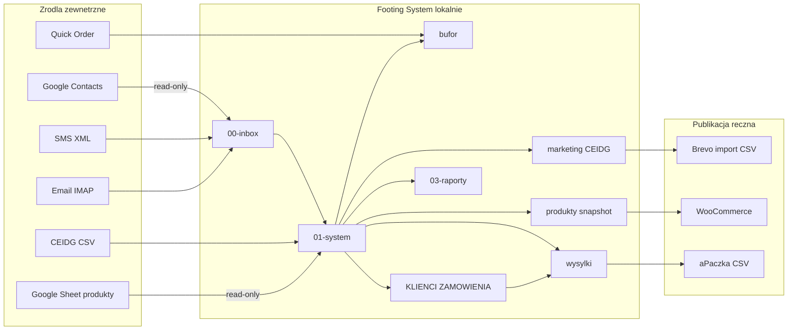

# Architektura aktualna Footing System

Wygenerowano: 2026-07-01 · audyt bez zmian w kodzie i folderach.  
Lokalizacja: `C:\dev\footing-system` · GitHub: `https://github.com/taciakowo/footing-system.git` · gałąź: `main`.

Poprzedni opis: `ARCHITEKTURA-SYSTEMU.md` (węższy, sprzed warstwy produktowej). Ten dokument zastępuje go jako **aktualny obraz całości**.

---

## 1. Streszczenie wykonawcze

### Czym system jest teraz

**Footing System** to lokalny system operacyjny małej firmy Footing, łączący:

- **CRM i zamówienia** (Footing = źródło prawdy dla klientów i zamówień),
- **bufor akceptacji** (SMS, e-mail, Quick Order),
- **produkty** (Google Sheet Product Master, read-only sync, audyt, eksport Woo CSV),
- **marketing B2B** (CEIDG → segmentacja → Brevo, osobny tor),
- **wysyłki** (CSV + aPaczka import, bez API),
- **integracje** (Google Contacts/Sheets read-only, plan Woo/Brevo/aPaczka),
- **panel** (szkic w `10-footing-panel/`, bez implementacji).

Dane wrażliwe pozostają w `00-inbox/` i `02-output-private/` (poza Git).

### Czym już nie jest

- Wyłącznie **footing-marketing** (wąski marketing / SEO / kampanie).
- Pełnym CRM/ERP w chmurze.
- Automatycznym synchronizatorem WooCommerce ↔ Google Sheets (stary monolit w `08-legacy-audit/` – odłożony).
- Systemem z jednym źródłem prawdy dla wszystkiego – **produkty** i **klienci** mają osobne źródła.

### Dlaczego `footing-marketing` było za wąskie

Projekt **wyrósł z wcześniejszego repozytorium `footing-marketing`**, ale obecnie repozytorium GitHub i folder lokalny to **`footing-system`** (`https://github.com/taciakowo/footing-system.git`). Zakres obejmuje CRM, bufor, Quick Order, wysyłki, produkty, CEIDG, integracje i przyszły panel — marketing to **jeden tor**, nie całość.

### Co oznacza przejście do Footing System

- Folder lokalny: `C:\dev\footing-system`.
- Numeracja warstw `00–10` (inbox → system → output → raporty → produkty → sprzedaż → marketing → integracje → legacy → quick-order → panel).
- Python w `01-system/` jako silnik lokalny; dokumentacja publiczna w `03-raporty/`, `04-produkty/`, `07-integracje/`.
- Rozdzielenie **prywatności** (CSV z PII) od **repozytorium** (kod + .md bez PII).

---

## 2. Aktualna mapa folderów

### Publiczne (Git OK)

| Folder | Rola | Pliki (Git) |
|--------|------|-------------|
| `01-system/` | Skrypty Python, requirements, config.example | 12 śledzonych + 1 nowy niesledzony |
| `03-raporty/` | Raporty .md bez PII | 16 (+2 nowe z audytu) |
| `04-produkty/` | Wiedza produktowa, Product Master | 2 śledzone + 1 nowy |
| `05-sprzedaz/` | Pion operacyjny (plan) | 5 README |
| `06-marketing/` | Pion marketingowy | 7 README |
| `07-integracje/` | Adaptery API (dokumentacja) | 19 README |
| `08-legacy-audit/` | Audyt starego sync | 7 plików |
| `09-quick-order/` | Spec Quick Order | 2 pliki |
| `10-footing-panel/` | Szkic panelu | 3 pliki |
| `05-kampanie/` | **Legacy** – migracja do 06-marketing | 3 pliki |
| `06-landingi/` | **Legacy** – migracja do 06-marketing | 2 pliki |
| `README.md`, `.gitignore` | Wejście, reguły Git | 2 pliki |

### Prywatne (NIE w Git)

| Folder | Pliki | Główne kategorie |
|--------|------:|------------------|
| `00-inbox/` | 9 | OAuth, cache Google, SMS, VCF, CSV/ODS wejściowe |
| `02-output-private/` | 62 | CRM czysty, bufor, wysyłki, CEIDG/Brevo, produkty, quick-order, archiwum |

**Kontrola Git:** żaden plik z `00-inbox/` ani `02-output-private/` nie jest śledzony.

`02-output-private/` – wysokopoziomowo:

- **Korzeń (~17 plików):** `KLIENCI.csv`, `ZAMOWIENIA.csv`, `POZYCJE-ZAMOWIEN.csv`, `KOMUNIKACJA.csv`, `WYSYLKI.csv`, `PACZKI.csv`, pliki kontrolne SEO/segmenty/VCF.
- **`bufor/` (4):** kandydaci do akceptacji klientów/zamówień/pozycji.
- **`marketing/` (11):** eksporty Brevo CEIDG (w tym TEST-050/100 i v2).
- **`produkty/` (5):** snapshoty Google Sheet, audyt, eksport Woo roboczy.
- **`quick-order/` (2):** zdarzenia i kolejka akceptacji.
- **`ceidg/`:** input fallback, kontrola, output czysty CEIDG.
- **`_archiwum/`:** stare `06-raporty/`, `10-sms/` (prywatne kopie).

### Operacyjne

- `01-system/` – uruchamianie skryptów lokalnie.
- `00-inbox/input/` – pliki CEIDG, duże CSV wejściowe.
- `02-output-private/bufor/` – codzienna praca przed akceptacją do CRM.

### Planowane

- `05-sprzedaz/woocommerce-sheets-sync/` – logika sync (docelowo).
- `10-footing-panel/` – UI Klienci + Zamówienia + Produkty (read).
- `07-integracje/woocommerce/`, `apaczka/` – adaptery API (read-first).

### Wymagające decyzji

| Obszar | Pytanie |
|--------|---------|
| `05-kampanie/`, `06-landingi/` | Kiedy przenieść do `06-marketing/` i usunąć legacy? |
| `01-system/` (13 plików) | Kiedy logiczny podział na podpakiety? |
| Assety produktowe (zdjęcia, rysunki) | Gdzie trzymać lokalnie – folder per SKU obok `02-output-private/produkty/`? |
| Mapowanie pól Sheet → WooCommerce | Walidacja `PRODUKTY-WOO-EXPORT.csv` vs wymagania sklepu |

---

## 3. Aktualna mapa modułów Python

### Tabela główna

| Moduł | Rola | Wejścia | Wyjścia | Prywatne | Zapis zewn. | Read-only | Zależności | Nazwa OK? | Przyszłość |
|-------|------|---------|---------|----------|-------------|-----------|------------|-----------|------------|
| `update_footing_database.py` | Orchestrator CRM: kontakty, SMS, e-mail → baza + bufor + wysyłki + raporty | `00-inbox/` (contacts cache, sms.xml, email_cache), `config.json` | `02-output-private/` CSV, `03-raporty/*.md` | tak | Slack webhook (opcj.) | częściowo (czyta inbox) | buffer, shipping, order_core, import_rules, csv | **tak**, ale ogólna | ewent. `crm_sync.py` + cienki orchestrator |
| `sync_google_contacts.py` | Pobranie kontaktów Google People API | OAuth, People API | `00-inbox/contacts_cache.csv`, `02-output-private/kontrola/GOOGLE-CONTACTS-POMINIETE.csv` | tak | **nie** (read-only Google) | **tak** | import_rules, pandas, google API | **tak** | zostaw; adapter doc w `07-integracje/google/` |
| `fetch_emails_imap.py` | Cache e-maili IMAP | `config.json`, skrzynka IMAP | `00-inbox/email_cache.csv` | tak | **nie** (tylko odczyt skrzynki) | **tak** (IMAP fetch) | stdlib | **tak** | zostaw |
| `footing_buffer.py` | Bufor akceptacji: SMS/e-mail/Quick Order → kandydaci | wywołania z update / quick_order | `02-output-private/bufor/BUFOR-*.csv` | tak | nie | n/d (biblioteka) | order_core, csv | **tak** | `buffer/` pakiet |
| `footing_order_core.py` | Parsowanie pozycji, tytuł sprawy, skróty nazw | tekst pozycji / items | struktury Python | nie | nie | n/d | — | **tak** | `core/orders.py` |
| `footing_import_rules.py` | Reguły kontaktów Google, wzorce produktów Footing | nazwy kontaktów | bool / parsed | nie | nie | n/d | — | **tak** | `core/import_rules.py` |
| `footing_csv.py` | Wspólny zapis CSV (`;`, UTF-8 BOM) | dict rows | pliki CSV | zależy | nie | n/d | — | **tak** | `core/csv_io.py` |
| `quick_order_events.py` | Zdarzenia Quick Order → bufor | JSON event (Android / plik) | `02-output-private/quick-order/*.csv` | tak | **nie** Google Contacts | zapis lokalny | buffer, order_core, csv | **tak** | zostaw; powiązać z `09-quick-order/` |
| `prepare_ceidg_mailing.py` | CEIDG → segmentacja → eksport Brevo CSV | `00-inbox/input/` CEIDG CSV | `02-output-private/marketing/BREVO-CEIDG-*`, `03-raporty/CEIDG-MAILING-001.md` | tak (CEIDG) | **nie** Brevo API | read CEIDG | import_rules (email), csv | **tak** (CEIDG jasne) | `marketing/ceidg_mailing.py` |
| `product_sheet_sync.py` | Product Master: Sheet → snapshot, formuły, walidacje, audyt, Woo CSV | Google Sheets API lub `--input-csv` | `02-output-private/produkty/PRODUKTY-*` | tak (snapshot) | **nie** Sheets/Woo | **tak** (Sheet) | csv, google API | **tak** | `products/sheet_sync.py` |
| `shipping_export.py` | Wysyłki, paczki, CSV aPaczka | `ZAMOWIENIA.csv`, `POZYCJE`, klienci | `WYSYLKI.csv`, `PACZKI.csv`, `APACZKA-IMPORT-001.csv`, raport `03-raporty/WYSYLKI.md` | tak | **nie** aPaczka API | n/d (biblioteka) | — | **tak** | `shipping/export.py` |
| `vcf_surowe_linie.py` | Diagnostyka surowych linii VCF | `contacts.vcf` | `02-output-private/VCF-SUROWE-LINIE.txt`, `DIAGNOSTYKA-VCF.csv` | tak | nie | tak | — | **tak** | narzędzie rzadkie – OK w system |

### Moduł produktowy – szczegóły

**`product_sheet_sync.py`**

- Spreadsheet ID: `1YtWrOgyJgNXFYaSg5-TeApJOOP3R25b9b62TT7lZqXE`
- Zakładka: `baza_produktow_footing`
- Tryb A (API): wartości obliczone, formuły (`userEnteredValue.formulaValue` via `includeGridData`), data validation / listy rozwijane (+ zakresy źródłowe)
- Tryb B (`--input-csv`): tylko wartości; `formulas_available=0`, `validations_available=0`
- **Nie wolno** traktować płaskiego CSV jako pełnego zamiennika arkusza bez warstwy formuł/walidacji

**Stan integracji Google Sheets API (2026-07):**

| Warstwa | Status | Uwagi |
|---------|--------|-------|
| OAuth + API | **Włączone, działa** | Token `google_token_sheets.json`, scope read-only |
| Wartości (`--snapshot-only`) | **Działa** | 142 produkty, 112 kolumn → `PRODUKTY-GOOGLE-SHEET-VALUES.csv` |
| Walidacje (`--inspect-validations`) | **Działa** | 852 walidacji / list rozwijanych |
| Eksport Woo (`--export-woo`) | **Działa** | `PRODUKTY-WOO-EXPORT.csv` (roboczy, bez publikacji) |
| Formuły (`--inspect-formulas`) | **Do dopracowania** | Obecnie 0 wykrytych formuł — wymaga poprawki diagnostyki/odczytu |

Warstwa **wartości i walidacji** jest operacyjna. Warstwa **formuł** wymaga dalszej pracy w module — bez niej audyt nie rozróżnia poprawnie pustych komórek od komórek z formułą o pustym wyniku.

---

## 4. Aktualna mapa danych

| Warstwa | Lokalizacja | Przykłady | Źródło prawdy |
|---------|-------------|----------|---------------|
| Surowe wejście | `00-inbox/` | contacts cache, sms.xml, email_cache, credentials | Zewnętrzne systemy |
| Bufor | `02-output-private/bufor/` | BUFOR-KLIENCI/ZAMOWIENIA/POZYCJE-DO-AKCEPTACJI | Footing (kandydaci) |
| Dane czyste CRM | `02-output-private/` korzeń | KLIENCI, ZAMOWIENIA, POZYCJE-ZAMOWIEN, KOMUNIKACJA | **Footing System** |
| Kontrola CRM | `02-output-private/` | DO-SPRAWDZENIA, SEGMENTY (zamrożone w sprincie mailingowym) | Footing |
| Produkty | `02-output-private/produkty/` | VALUES, FORMULAS, VALIDATIONS, BRAKI, WOO-EXPORT | Snapshot z **Google Sheet** |
| Marketing CEIDG | `02-output-private/marketing/` | BREVO-CEIDG-001, TEST-050-v2, TEST-100-v2, audyt priorytetu | CEIDG → Footing |
| Wysyłki | `02-output-private/` korzeń | WYSYLKI, PACZKI, APACZKA-IMPORT, KLUCZ-WYSYLKOWY | Footing (z zamówień) |
| Quick Order | `02-output-private/quick-order/` | QUICK-ORDER-EVENTS, DO-AKCEPTACJI | Footing |
| Raporty publiczne | `03-raporty/` | PODSUMOWANIE, PRODUKCJA, WYSYLKI, CEIDG-MAILING-001 | Agregaty bez PII |
| Wiedza produktowa | `04-produkty/` | PRODUKTY.md, GOOGLE-SHEET-PRODUCT-MASTER.md | Dokumentacja + Sheet |
| Assety produktowe | *brak ustandaryzowanego folderu Git* | zdjęcia, rysunki – powiązanie przez SKU w Sheet | Sheet + pliki lokalne (plan) |

---

## 5. Źródła prawdy

| Domena | Źródło prawdy | Footing System | Uwagi |
|--------|---------------|----------------|-------|
| Klienci, zamówienia, komunikacja | **Footing System** (`02-output-private/`) | Zapis lokalny CSV | Google Contacts tylko read-only import |
| Produkty (opisy, ceny, parametry, status) | **Google Sheet** `baza_produktow_footing` | Read-only sync, audyt, eksport | Formuły i listy rozwijane w arkuszu |
| WooCommerce | **Publikacja** | Eksport CSV roboczy, API odłożone | Nie źródło prawdy |
| Google Contacts | **Google** | Read-only cache | Brak write-back |
| Brevo | **Kanał wysyłki** | Import list CSV ręczny | Nie baza prawdy klientów |
| CEIDG | **Rejestr publiczny** | Segmentacja mailingowa osobno | Nie mieszać z CRM |
| aPaczka | **Przewoźnik (plan)** | CSV import | API odłożone |

**SKU** łączy warstwy: produkt w Sheet ↔ pozycje zamówień ↔ wysyłki ↔ przyszłe assety (zdjęcie, rysunek techniczny).

---

## 6. Przepływy danych



### Opis tekstowy

1. **Google Contacts → CRM:** `sync_google_contacts.py` → cache → `update_footing_database.py` → KLIENCI/ZAMOWIENIA (nazwa kontaktu Google = główne źródło zamówień historycznych).
2. **SMS/e-mail → bufor:** ten sam orchestrator wykrywa sygnały handlowe → `bufor/BUFOR-*.csv` (bez automatycznej akceptacji).
3. **Quick Order → bufor:** `quick_order_events.py` → quick-order → merge w update → bufor.
4. **CEIDG → Brevo CSV:** `prepare_ceidg_mailing.py` – osobny tor, `zrodlo=ceidg`, listy testowe **v2** po poprawce priorytetu (nie stare TEST-050/100).
5. **Google Sheet produkty → audyt/eksport:** `product_sheet_sync.py` – wartości i walidacje działają; formuły wymagają poprawki → audyt braków (ograniczony) → `PRODUKTY-WOO-EXPORT.csv` (bez auto-publikacji).
6. **Produkty → wysyłki:** `shipping_export.py` używa pozycji zamówień i słownika gabarytów (`KLUCZ-WYSYLKOWY.csv`) – powiązanie przez kody produktów/SKU.
7. **Zamówienia → wysyłki:** po zaakceptowanych zamówieniach, adresach i danych kontaktowych.

---

## 7. Ocena nazewnictwa

### Dobre – zostawić

| Nazwa | Powód |
|-------|-------|
| `00-inbox/`, `02-output-private/` | Jasny podział prywatne/publiczne |
| `03-raporty/` | Raporty bez PII |
| `04-produkty/` | Wiedza produktowa |
| `07-integracje/` | Adaptery oddzielone od logiki |
| `08-legacy-audit/` | Wyraźne odseparowanie monolitu |
| `footing_csv.py`, `footing_import_rules.py`, `footing_order_core.py` | Spójny prefiks bibliotek |
| `prepare_ceidg_mailing.py` | CEIDG w nazwie – nie myli z CRM |
| `product_sheet_sync.py` | Opisuje rolę (Sheet, sync, read) |
| `sync_google_contacts.py` | Kierunek i read-only jasne |
| `quick_order_events.py` | Powiązanie z `09-quick-order/` |

### Historyczne, akceptowalne

| Nazwa | Uwaga |
|-------|-------|
| `footing-marketing` (historycznie) | Poprzednia nazwa projektu/repo; dziś `footing-system` |
| `05-kampanie/`, `06-landingi/` | Legacy – wiadomo dokąd migrować |
| `update_footing_database.py` | „Database” = CSV lokalne, nie SQLite – nazwa tradycyjna |
| `06-marketing/` vs CEIDG w `01-system/` | CEIDG logicznie marketing, skrypt słusznie poza CRM |

### Mylące / ryzyko

| Nazwa | Problem |
|-------|---------|
| `update_footing_database.py` | Br brzmi jak SQL/ERP; robi CRM+bufor+wysyłki+raporty |
| `07-integracje/google-contacts-write/` | Sugeruje zapis – **zablokowane**; mylące vs read-only |
| `05-sprzedaz/woocommerce-sheets-sync/` | Nazwa legacy (Sheets↔Woo monolit); dziś sync produktów jest read-only w `product_sheet_sync.py` |
| Stare `BREVO-CEIDG-TEST-050.csv` | Myli z v2 po poprawce priorytetu |

### Do rozważenia w przyszłości

| Obecna | Kierunek |
|--------|----------|
| `01-system/` (flat) | Podfoldery: `core/`, `crm/`, `products/`, `marketing/`, `shipping/` |
| `10-footing-panel/` | OK jako numer; implementacja może być osobne repo lub podfolder |
| Assety SKU | Np. `02-output-private/assets/{SKU}/` (prywatne) lub CDN później |

---

## 8. Proponowana docelowa logika systemu (propozycja – **bez zmian teraz**)

```
01-system/
├── core/           # csv, import_rules, order_core, config
├── crm/            # update_footing_database, buffer, vcf tools
├── integrations/   # sync_google_contacts, fetch_emails_imap
├── products/       # product_sheet_sync (+ przyszłe asset linker)
├── marketing/      # prepare_ceidg_mailing
├── shipping/       # shipping_export
├── quick_order/    # quick_order_events
└── panel/          # przyszły serwis API pod 10-footing-panel
```

Alternatywa: zostawić flat `01-system/` do ~20 plików, potem jeden podział.

Panel (`10-footing-panel/`): **Klienci | Zamówienia | Produkty (read) | Bufor** – zgodnie z `PANEL-SCOPE.md`.

---

## 9. Ryzyka architektoniczne

| Ryzyko | Opis | Mitigacja obecna |
|--------|------|------------------|
| Rozrost `01-system/` | 13 plików, jeden orchestrator ~2200 linii | Biblioteki wydzielone; dokumentacja audytu |
| Mieszanie marketingu z CRM | CEIDG vs KLIENCI | Osobne foldery output, `zrodlo`, brak merge |
| Produkty vs wysyłki | Gabaryty w KLUCZ-WYSYLKOWY vs Sheet | SKU jako łącznik; docelowo parametry z Sheet |
| Utrata logiki formuł Sheet | Eksport tylko VALUES; odczyt formuł zwraca 0 | **Częściowo opanowane** — walidacje czytane (852); formuły wymagają poprawy w `product_sheet_sync.py` |
| Ręczna praca w CSV | Panel jeszcze nie ma | Bufor + DO-SPRAWDZENIA |
| Nadpisywanie Google | Stary monolit Apps Script | Footing read-only; `google-contacts-write` tylko docs |
| Import całej bazy do Brevo | Setki tys. CEIDG | TEST-050-v2, TEST-100-v2, partiami |
| Spójność SKU–zdjęcie–rysunek | Brak folderu assetów | Kolumny image_main, drawing w Sheet + audyt |
| Sheets API | Sync produktów | **Włączone** — wartości i walidacje OK; formuły do dopracowania |

---

## 10. Rekomendacje najbliższych decyzji

### Teraz

1. **Dokończyć poprawkę odczytu formuł** w `product_sheet_sync.py` i dopiero potem commitować moduł produktowy jako stabilny.
2. Mailing CEIDG: używać **TEST-050-v2 / TEST-100-v2**, nie starych list.
3. Utrzymać `.gitignore` dla `00-inbox/`, `02-output-private/` – kontrola ok.
4. Zatwierdzić raport audytu w Git (bez prywatnych plików).

### Po mailingu testowym CEIDG

1. Ocena bounce/unsubscribe Brevo.
2. Decyzja o partii B/C CEIDG.
3. Nie importować CRM do Brevo.

### Po uporządkowaniu sklepu

1. Walidacja `PRODUKTY-WOO-EXPORT.csv` vs stan Woo (ręcznie).
2. Uzupełnienie `KLUCZ-WYSYLKOWY.csv` gabarytami per SKU.
3. Standard lokalizacji zdjęć/rysunków per SKU.

### Później

1. Panel (`10-footing-panel/`) – MVP Klienci + Zamówienia.
2. WooCommerce API read-only (`07-integracje/woocommerce/`).
3. aPaczka API po stabilizacji CSV.
4. WooCommerce API read-only (`07-integracje/woocommerce/`).
5. aPaczka API po stabilizacji CSV.
6. Migracja treści `05-kampanie/`, `06-landingi/` → `06-marketing/`.
7. Rozbicie `01-system/` na podpakiety.

---

## 11. Plan migracji nazw (propozycja – nie wykonywać teraz)

| Obecna nazwa | Proponowana | Powód | Ryzyko | Kiedy |
|--------------|-------------|-------|--------|-------|
| `update_footing_database.py` | `crm_update.py` lub pakiet `crm/` | Precyzja roli | Wysokie – główne entrypoint | Po panelu lub podziale modułów |
| `07-integracje/google-contacts-write/` | `google-contacts-readonly/` lub usunąć write z nazwy | Mylące | Niskie – tylko docs | Przy następnej edycji integracji |
| `05-sprzedaz/woocommerce-sheets-sync/` | `product-publish/` | Oddziela sync od legacy Sheets↔Woo | Średnie | Przed Woo API write |
| `05-kampanie/` | przeniesienie do `06-marketing/kampanie/` | Jedna struktura marketingu | Niskie | Sprint porządkowy docs |
| `06-landingi/` | `06-marketing/landingi/` | j.w. | Niskie | j.w. |
| `ARCHITEKTURA-SYSTEMU.md` | archiwum / redirect do tego pliku | Uniknięcie duplikatu | Niskie | Po akceptacji tego raportu |

**Bez zmian:** `00-inbox`, `02-output-private`, `prepare_ceidg_mailing.py`, `product_sheet_sync.py`, `04-produkty/`.

---

## 12. Pytania decyzyjne do użytkownika

1. **Assety produktowe:** Gdzie trzymać zdjęcia i rysunki techniczne lokalnie (struktura per SKU)?
2. **Panel:** Priorytet MVP – najpierw Klienci+Zamówienia czy też podgląd produktów z Sheet?
3. **WooCommerce:** Kiedy pierwszy test read-only API vs wystarczy CSV export z Sheet?
4. **CEIDG mailing:** Po teście v2 – jaka wielkość partii B i czy segmentacja A/B/C jest wystarczająca?
5. **Legacy foldery:** Czy usunąć `05-kampanie/`, `06-landingi/` po skopiowaniu do `06-marketing/`?
6. **`01-system/`:** Czy rozbijać na podfoldery przed czy po panelu?
7. **Google Contacts write:** Czy kiedykolwiek write-back, czy na stałe read-only?
8. **SQLite:** Czy w ogóle planowany, czy CSV pozostaje źródłem operacyjnym do panelu?
9. **Monolit Apps Script:** Co zachować z `08-legacy-audit/` (formuły, segmenty), a co wyrzucić?
10. **Formuły Sheet:** Po poprawce odczytu — czy audyt braków ma traktować puste wyniki formuł jako ostrzeżenia?

---

## Kontrola końcowa audytu

| Test | Wynik |
|------|-------|
| `python -m py_compile` (wszystkie `.py` w `01-system/`) | **OK** |
| `git ls-files \| Select-String "00-inbox\|02-output-private"` | **Pusto (OK)** |
| `git diff --check` | **Brak problemów** |
| Prywatne pliki w Git | **Brak – krytyczny problem nie występuje** |
| `config.json` lokalny | W `.gitignore` – nie śledzony (OK) |

---

*Dokument wygenerowany w ramach audytu architektury. Nie wprowadzono zmian w strukturze folderów, nazwach plików ani kodzie produkcyjnym.*
