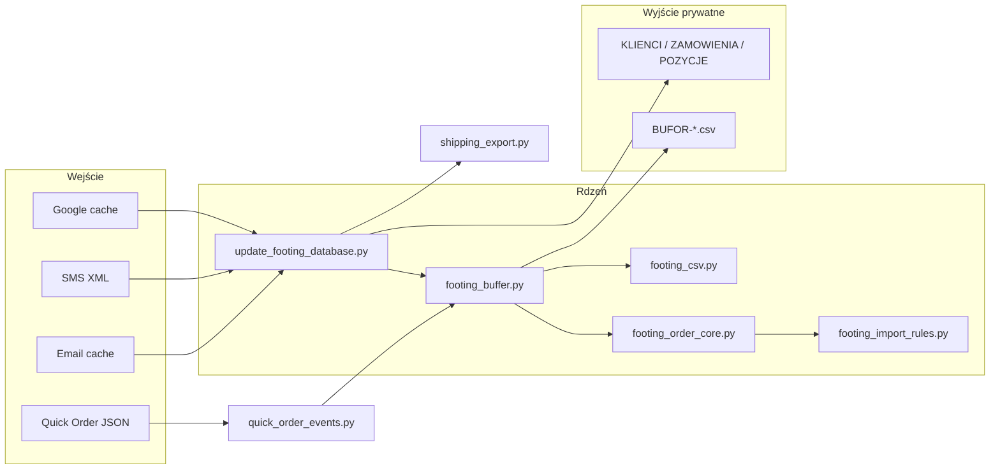

# Footing System – kontekst dla nowego czatu GPT

**Wygenerowano:** 2026-06-27
**Cel dokumentu:** bezpieczne przekazanie kontekstu technicznego i operacyjnego bez danych osobowych (PII).
**Repozytorium lokalne:** `c:\dev\footing-marketing` (nazwa GitHub: `footing-marketing`; docelowa nazwa projektu: Footing System).

---

## 1. Cel systemu

### Czym jest Footing System

Lokalny system operacyjny małej firmy Footing (producent fundamentów / kotew / stóp do konstrukcji ogrodowych). Łączy sprzedaż, klientów, zamówienia, komunikację (SMS, e-mail), marketing, wysyłki i przyszły panel operatorski.

**Nie jest** pełnym CRM/ERP ani narzędziem do codziennej pracy w Cursorze.

### Dlaczego powstał

- Historycznie dane żyły w **Google Contacts** (nazwy kontaktów = zamówienia) i arkuszach.
- Rosła liczba źródeł: SMS, e-mail, Quick Order, planowany WooCommerce, CEIDG, wysyłki.
- Potrzebna jest **jedna warstwa prawdy** (Footing System) z akceptacją zmian z komunikacji, bez nadpisywania Google.

### Problemy, które rozwiązuje

| Problem | Rozwiązanie |
|---------|-------------|
| Rozproszone źródła | Pipeline `01-system/` → CSV + raporty |
| Brak kontroli nad SMS/e-mail | Bufor akceptacji przed zapisem do danych czystych |
| Mylenie nazwy Google z tytułem sprawy | Osobne pola: `nazwa_kontaktu_google` vs `tytul_sprawy` |
| Fałszywe produkty z parsera | `footing_import_rules.py` + span tracking |
| Brak panelu operatorskiego | Planowany Footing Panel (Streamlit MVP) |

### Główne źródła danych

Google Contacts cache, VCF fallback, SMS XML, e-mail cache/IMAP, Quick Order JSON, (przyszłe) WooCommerce, CEIDG CSV, dane wysyłkowe.

### Główne wyjścia

- **Dane czyste CRM:** `KLIENCI.csv`, `ZAMOWIENIA.csv`, `POZYCJE-ZAMOWIEN.csv`
- **Bufor akceptacji:** `bufor/BUFOR-*.csv`
- **Diagnostyka:** `DO-SPRAWDZENIA.csv`, `KONTAKTY-Z-KOMUNIKACJI-NIEPOWIAZANE.csv`
- **Marketing/wysyłki:** eksporty w `02-output-private/marketing/`, `WYSYLKI.csv`, itd.
- **Raporty publiczne:** `03-raporty/` (agregaty, bez PII)

### Dlaczego Cursor nie jest narzędziem operacyjnym

Operator nie powinien ręcznie edytować CSV, uruchamiać skryptów ani akceptować bufora w IDE. Cursor służy do **programowania**; codzienna praca ma trafić do **Footing Panel** (Klienci | Zamówienia).

---

## 2. Najważniejsze decyzje architektoniczne

| Decyzja | Status |
|---------|--------|
| **Footing System = źródło prawdy** | Aktywne |
| **Google Contacts tylko read-only** | Aktywne – brak `updateContact`, brak `GOOGLE-CONTACTS-ZMIANY` |
| **`nazwa_kontaktu_google`** | Pole odczytowe (snapshot z cache) |
| **`tytul_sprawy`** | Pole Footing System; format operacyjny, bez prefiksów BUFOR/NOWY |
| **Trzy poziomy danych** | Surowe → bufor → czyste |
| **Panel: dwa miejsca pracy** | Klienci + Zamówienia (Quick Order wewnątrz Zamówień) |
| **CSV = warstwa przejściowa** | Separator `;`, encoding `utf-8-sig` |
| **SQLite** | Docelowo, nie w bieżącym etapie |
| **Cursor** | Tylko development, nie operacje |

Szczegóły polityki Google: `03-raporty/KONTROLA-CRM-KONTAKTY.md`, `07-integracje/google-contacts-write/README.md`.

---

## 3. Struktura katalogów

```
footing-marketing/
├── 00-inbox/              # PRYWATNY – wejście surowe (Git ignore)
├── 01-system/             # Skrypty Python – rdzeń systemu
├── 02-output-private/     # PRYWATNY – CSV, bufor, marketing (Git ignore)
├── 03-raporty/            # Raporty publiczne (bez PII)
├── 04-produkty/           # Dokumentacja produktów / słownik (plan)
├── 05-sprzedaz/           # Zamówienia, wysyłki, magazyn (docs)
├── 06-marketing/          # Brevo, SEO, segmenty, landingi
├── 07-integracje/         # Adaptery API (Google, aPaczka, Woo, …)
├── 08-legacy-audit/       # Audyt starego sync Woo ↔ Google Sheets
├── 09-quick-order/        # JSON przykładowy + README
├── 10-footing-panel/      # Dokumentacja panelu (bez kodu UI)
├── README.md
└── .gitignore
```

### Foldery prywatne (Git ignore)

| Folder | Zawartość (kategorie, bez wypisywania PII) |
|--------|---------------------------------------------|
| `00-inbox/` | `contacts_cache.csv`, `sms.xml`, `email_cache.csv`, `contacts.vcf`, OAuth tokeny lokalne |
| `02-output-private/` | CRM, bufor, komunikacja, wysyłki, quick-order, marketing, ceidg, kontrola |

**Kontrola Git:** `git ls-files | Select-String "00-inbox|02-output-private"` → **brak wyników** (foldery nie są śledzone).

### Foldery publiczne – główne pliki

| Folder | Pliki / rola |
|--------|----------------|
| `01-system/` | Skrypty pipeline (patrz sekcja 4) |
| `03-raporty/` | `SCHEMAT-DANYCH.md`, `KONTROLA-CRM-KONTAKTY.md`, `STAN-SYSTEMU.md`, raporty dzienne |
| `09-quick-order/` | `README.md`, `examples/quick_order_event.example.json` (przykład z fikcyjnymi danymi) |
| `10-footing-panel/` | `README.md`, `PANEL-SCOPE.md`, `DATA-MODEL-DRAFT.md` |
| `08-legacy-audit/` | Audyt synchronizatora Woo/Sheets – do późniejszego wykorzystania |

---

## 4. Moduły `01-system/`

### Zależności między modułami (uproszczone)



### `update_footing_database.py`

| Aspekt | Opis |
|--------|------|
| **Rola** | Główny orchestrator CRM – buduje dane czyste, komunikację, bufor, raporty |
| **Wejście** | Google cache/VCF, SMS, e-mail cache, lista czystych klientów |
| **Wyjście** | `KLIENCI.csv`, `ZAMOWIENIA.csv`, `POZYCJE-ZAMOWIEN.csv`, `KOMUNIKACJA.csv`, `DO-SPRAWDZENIA.csv`, bufor, raporty `03-raporty/` |
| **Ograniczenia** | KLIENCI czyste tylko z Google (`contact_is_footing_client`); SMS/e-mail → bufor, nie czyste |
| **Obszar** | CRM, bufor, marketing (Brevo), SEO, segmenty |

**Kluczowe funkcje:** `load_contacts`, `parse_contact_name`, `contact_is_footing_client`, `load_sms`, `load_email_cache`, `build_do_sprawdzenia`, `enrich_crm_tables`, `build_brevo_exports`, `write_public_reports`, `main`.

**Stałe kolumn:** `CLIENT_COLS`, `ORDER_COLS`, `ITEM_COLS`, `ZAMOWIENIA_WIDOK_COLS`, `REVIEW_COLS`, `KOM_COLS`.

### `sync_google_contacts.py`

| Aspekt | Opis |
|--------|------|
| **Rola** | Pobranie kontaktów z Google People API → cache CSV |
| **Wejście** | OAuth credentials lokalne |
| **Wyjście** | `00-inbox/contacts_cache.csv`, `02-output-private/kontrola/GOOGLE-CONTACTS-POMINIETE.csv` |
| **Ograniczenia** | **Tylko read** – nie modyfikuje Google |
| **Obszar** | Google |

**Funkcje:** `fetch_all_connections`, `parse_person`, `sync_contacts`, `main`.

### `footing_csv.py`

| Aspekt | Opis |
|--------|------|
| **Rola** | Wspólny zapis CSV: `;`, `utf-8-sig`, normalizacja tekstu |
| **Funkcje** | `normalize_text`, `write_csv`, `append_csv_rows` |

### `footing_buffer.py`

| Aspekt | Opis |
|--------|------|
| **Rola** | Bufor akceptacji – kandydaci z SMS/e-mail/Quick Order |
| **Wejście** | Treść wiadomości, Quick Order events |
| **Wyjście** | `bufor/BUFOR-*.csv`, `BUFOR-POWIADOMIENIA.md`, `KONTAKTY-Z-KOMUNIKACJI-NIEPOWIAZANE.csv` |
| **Obszar** | Bufor, Quick Order merge |

**Kluczowe funkcje:**

- Sanityzacja: `truncate_at_stoplist`, `prepare_buffer_fields`, `filter_parsed_items`, `resanitize_buffer_store`
- Limity: `LIMIT_TYTUL=120`, `LIMIT_PRODUKTY=160`, `LIMIT_OPIS=120`
- Deduplikacja: `build_user_merge_key`, `merge_rows_by_user_key`, `candidate_hash`, `quick_order_content_hash`
- Routing: `detect_commercial_signals`, `is_system_notification`, `add_candidate`, `add_quick_order`
- Eksport: `write_buffer_exports`, `write_buffer_notification`, `merge_quick_order_files`

**Klasa:** `BufferStore` – trzyma listy klienci/zamówienia/pozycje/niepowiązane, hash techniczny, licznik scalonych.

### `footing_import_rules.py`

| Aspekt | Opis |
|--------|------|
| **Rola** | Reguły produktów Footing, filtr Google Contacts, span tracking |
| **Funkcje** | `evaluate_google_contact`, `has_footing_product`, `find_qty_product_matches`, `find_standalone_products`, `find_unknown_qty_products`, `is_embedded_code` |
| **Obszar** | Parser, Google import |

### `footing_order_core.py`

| Aspekt | Opis |
|--------|------|
| **Rola** | Tytuł sprawy, parsowanie pozycji z tekstu |
| **Typy** | `ParsedLineItem`, `ItemsParseResult` |
| **Funkcje** | `parse_items_text`, `build_tytul_sprawy`, `extract_skrot_nazwy`, `normalize_event_date` |
| **Obszar** | CRM, bufor, Quick Order |

### `quick_order_events.py`

| Aspekt | Opis |
|--------|------|
| **Rola** | Przyjęcie JSON zdarzenia → CSV events + DO-AKCEPTACJI |
| **Wyjście** | `QUICK-ORDER-EVENTS.csv`, `QUICK-ORDER-DO-AKCEPTACJI.csv` |
| **Deduplikacja** | `quick_order_content_hash` – ten sam JSON pomijany |
| **Ograniczenia** | Brak zapisu do Google |
| **Obszar** | Quick Order |

### `prepare_ceidg_mailing.py`

| Aspekt | Opis |
|--------|------|
| **Rola** | Importer CEIDG → eksport Brevo (CSV-only) |
| **Wejście** | `00-inbox/input/` (CSV; ODS bez flagi pomijane) |
| **Wyjście** | `BREVO-CEIDG-001.csv`, `INPUT-ROZPOZNANIE.csv`, raporty |
| **Status** | **Odłożone** – nie rozwijać masowo przed CRM/panel |
| **Obszar** | CEIDG, marketing |

### `shipping_export.py`

| Aspekt | Opis |
|--------|------|
| **Rola** | Wysyłki, paczki, import aPaczka (CSV), klucz wagowy |
| **Wyjście** | `WYSYLKI.csv`, `PACZKI.csv`, `WYSYLKI-DO-SPRAWDZENIA.csv`, `APACZKA-IMPORT-001.csv` |
| **Status** | Działa eksport; wiele braków adresów/e-maili; API aPaczka odłożone |
| **Obszar** | Wysyłki |

### Pozostałe moduły

| Plik | Rola |
|------|------|
| `fetch_emails_imap.py` | Pobranie e-maili → `email_cache.csv` |
| `vcf_surowe_linie.py` | Diagnostyka VCF – surowe linie |
| `config.example.json` | Szablon konfiguracji (lokalny `config.json` w Git ignore) |
| `requirements.txt` | `google-api-python-client`, `pandas`, `odfpy`, … |

---

## 5. Dane wejściowe

| Źródło | Status | Cel | Czyste / bufor | Ryzyka |
|--------|--------|-----|---------------|--------|
| **Google Contacts cache** | Aktywne | `KLIENCI`, `ZAMOWIENIA`, `POZYCJE` | **Czyste** (historyczne) | Tylko kontakty z „Klient” + data + produkt |
| **VCF fallback** | Awaryjne | Jak Google | Czyste | Gorsza jakość nazw |
| **SMS XML** | Aktywne | Bufor + `KOMUNIKACJA` | **Bufor** (nowe sygnały) | Gadatliwe treści – sanityzacja w buforze |
| **E-mail cache / IMAP** | Aktywne | Bufor + `KOMUNIKACJA` | **Bufor** | HTML, newslettery → niepowiązane |
| **Quick Order JSON** | Aktywne | Bufor + events CSV | **Bufor** | Dedup po hash |
| **WooCommerce** | Plan | Formalne zamówienia sklepu | Przyszłe czyste ze statusem `zaakceptowane_zrodlo_woocommerce` | Legacy w `08-legacy-audit/` |
| **CEIDG CSV** | Odłożone | Brevo B2B | Osobny tor, nie CRM | 122k+ rekordów – nie commitować |
| **Wysyłki / aPaczka** | Częściowo | `WYSYLKI.csv` | Zależy od CRM | Braki adresów |
| **Footing Panel** | Plan | Akceptacja, edycja | Bufor → czyste | Nie zaimplementowany |

---

## 6. Dane wyjściowe i CSV

**Wspólne reguły:** separator `;`, encoding `utf-8-sig` (UTF-8 BOM).

| Plik | Warstwa | Rekordy* | Kolumn | Przeznaczenie |
|------|---------|----------|--------|---------------|
| `KLIENCI.csv` | Czyste | 171 | 27 | Klienci zaakceptowani (Google) |
| `ZAMOWIENIA.csv` | Czyste | 171 | 21 | Zamówienia historyczne |
| `POZYCJE-ZAMOWIEN.csv` | Czyste | 203 | 17 | Pozycje zamówień |
| `ZAMOWIENIA-WIDOK.csv` | Czyste / widok | 171 | 15 | Widok operatorski bez ID |
| `DO-SPRAWDZENIA.csv` | Diagnostyka | 16 | 14 | Problemy parsera / brak ilości |
| `KOMUNIKACJA.csv` | Surowe/zindeksowane | 674 | 12 | Historia SMS/e-mail |
| `EMAIL-KONTAKTY.csv` | Diagnostyka | 37 | 10 | Mapowanie e-mail → klient |
| `KONTAKTY-Z-KOMUNIKACJI-NIEPOWIAZANE.csv` | Techniczne | 176 | 12 | Newsletter, brak sygnału |
| `bufor/BUFOR-KLIENCI-DO-AKCEPTACJI.csv` | Bufor | 366 | 25 | Kandydaci klienci |
| `bufor/BUFOR-ZAMOWIENIA-DO-AKCEPTACJI.csv` | Bufor | 104 | 26 | Kandydaci zamówienia |
| `bufor/BUFOR-POZYCJE-DO-AKCEPTACJI.csv` | Bufor | 153 | 24 | Kandydaci pozycje |
| `bufor/BUFOR-POWIADOMIENIA.md` | Raport techniczny | — | — | Podsumowanie bufora (UTF-8 BOM) |
| `quick-order/QUICK-ORDER-EVENTS.csv` | Quick Order | 2 | 17 | Rejestr zdarzeń (legacy + nowy hash) |
| `quick-order/QUICK-ORDER-DO-AKCEPTACJI.csv` | Quick Order | 2 | 17 | Kolejka akceptacji QO |
| `WYSYLKI.csv` | Wysyłki | 171 | 25 | Przesyłki |
| `PACZKI.csv` | Wysyłki | 171 | 16 | Paczki w przesyłce |
| `WYSYLKI-DO-SPRAWDZENIA.csv` | Diagnostyka | 171 | 13 | Braki w wysyłkach |
| `APACZKA-IMPORT-001.csv` | Eksport aPaczka | 0 | 20 | Pusty – brak gotowych danych |
| `KLUCZ-WYSYLKOWY.csv` | Słownik | 10 | 12 | Wagi/gabaryty produktów |
| `marketing/BREVO-CEIDG-001.csv` | Marketing CEIDG | 122298 | 14 | **Nie commitować** – osobna baza B2B |
| `DIAGNOSTYKA-VCF.csv` | Diagnostyka VCF | 234 | 6 | Tylko przy braku Google cache |
| `ceidg/INPUT-ROZPOZNANIE.csv` | CEIDG | brak pliku | — | Powstaje po uruchomieniu CEIDG |

\*Liczby z odczytu nagłówków i licznika wierszy (2026-06-27), bez treści rekordów.

### Przykładowe nagłówki (bez wierszy danych)

**KOMUNIKACJA:** `message_id;klient_id;data;kanal;kierunek;telefon;email;temat;tresc;typ_wiadomosci;powiazane_order_id;status_sprawdzenia`

**BUFOR-KLIENCI:** `status_bufora;powod_bufora;tytul_sprawy;zrodlo;data;telefon;email;nazwa_klienta;…;fragment_tresci;…;user_merge_key;source_ids;liczba_zrodel;created_at`

---

## 7. Schemat danych czystych

### KLIENCI.csv (27 kolumn)

1. nazwa_kontaktu_google
2. pierwsza_data
3. telefon
4. email
5. nazwa_klienta
6. adres
7. nr_adresu
8. nr_lokalu
9. kod_pocztowy
10. miasto
11. nip
12. status_sprawdzenia
13. uwagi
14. inwestycja
15. segment
16. ostatnia_data
17. produkty
18. wartosc_zamowien
19. liczba_zamowien
20. produkt_glowny
21. skrot_nazwy
22. ostatnia_komunikacja
23. zrodla
24. klient_id
25. contact_resource_name
26. google_etag
27. hash

### ZAMOWIENIA.csv (21 kolumn)

1. data_zamowienia
2. tytul_sprawy
3. nazwa_kontaktu_google
4. telefon
5. produkty
6. ilosc_sztuk
7. liczba_pozycji
8. status_zamowienia
9. status_sprawdzenia
10. kwota
11. dostawa
12. adres_dostawy
13. email
14. nazwa_klienta
15. uwagi
16. zrodlo
17. zamowienie_id
18. klient_id
19. source_id
20. hash
21. pozycje_tekst *(pole techniczne/agregat)*

### POZYCJE-ZAMOWIEN.csv (17 kolumn)

1. data_zamowienia
2. nazwa_kontaktu_google
3. telefon
4. ilosc
5. produkt
6. wariant
7. nr_katalogowy
8. opis_pozycji
9. inwestycja
10. status_pozycji
11. status_sprawdzenia
12. uwagi
13. pozycja_id
14. zamowienie_id
15. klient_id
16. source_id
17. hash

### ZAMOWIENIA-WIDOK.csv (15 kolumn)

1. data_zamowienia
2. status_zamowienia
3. tytul_sprawy
4. produkty
5. ilosc_sztuk
6. liczba_pozycji
7. inwestycja
8. nazwa_kontaktu_google
9. telefon
10. dostawa
11. kwota
12. adres_dostawy
13. email
14. nazwa_klienta
15. uwagi

---

## 8. Bufor

### Pliki

| Plik | Rola |
|------|------|
| `BUFOR-KLIENCI-DO-AKCEPTACJI.csv` | Kandydaci klientów z komunikacji |
| `BUFOR-ZAMOWIENIA-DO-AKCEPTACJI.csv` | Kandydaci zamówień |
| `BUFOR-POZYCJE-DO-AKCEPTACJI.csv` | Pozycje (szczegóły zamówienia w panelu) |
| `BUFOR-POWIADOMIENIA.md` | Podsumowanie dla operatora |
| `KONTAKTY-Z-KOMUNIKACJI-NIEPOWIAZANE.csv` | Techniczne odrzuty |
| `DO-SPRAWDZENIA.csv` | Problemy parsera w danych czystych / review |

### Routing

| Sytuacja | Cel |
|----------|-----|
| SMS/e-mail z produktem, NIP, wysyłką, wyceną, intencją zamówienia | Bufor (+ zamówienie/pozycje jeśli rozpoznano produkt) |
| Newsletter, no-reply, systemowe (Allegro status, bank, RODO) | `KONTAKTY-Z-KOMUNIKACJI-NIEPOWIAZANE.csv` |
| Treść niehandlowa | Niepowiązane |
| Brak sygnału handlowego | Niepowiązane |
| Klient już w czystych + brak nowego sygnału zamówienia | Pominięcie bufora |
| Parser: brak ilości / spoza słownika | `status_sprawdzenia` + `DO-SPRAWDZENIA.csv` |

### Statusy

| Pole | Znaczenie |
|------|-----------|
| `status_bufora` | `do_akceptacji` lub `wymaga_korekty` (np. konflikt dopasowania klienta) |
| `status_sprawdzenia` | Jakość parsera: `ok`, `produkt_spoza_slownika`, `do_sprawdzenia_brak_ilosci`, `wymaga_korekty`, … |
| `powod_bufora` | `kandydat_z_komunikacji`, `quick_order`, `konflikt_dopasowania_klienta`, … |

### Klucze deduplikacji

| Klucz | Opis |
|-------|------|
| `hash` | Hash techniczny – unikalność rekordu źródłowego |
| `user_merge_key` | Hash z pól użytkowych (typ, telefon, email, data, tytuł, produkty, ilość, adres) – scala duplikaty widoczne dla człowieka |
| `content_hash` (Quick Order) | Stabilny hash treści JSON – duplikat pomijany |
| `source_ids` / `liczba_zrodel` | Po scaleniu – lista źródeł, uwaga `scalono_duplikaty_bufora` |

**Zasada:** dane buforowe **nigdy** nie mieszają się automatycznie z `KLIENCI.csv` / `ZAMOWIENIA.csv` bez akceptacji w panelu.

---

## 9. Tytuł sprawy i sanityzacja

### Format docelowy

```
YYYY.MM.DD Klient ILOSCxPRODUKT [INWESTYCJA] [SKROT_NAZWY]
```

Przykłady (fikcyjne): `2026.06.27 Klient 4xZ25-K130 Pergola`, `2026.06.27 Klient K2-R260`

### Zasady

- **Bez prefiksów** BUFOR / NOWY w tytule
- **Limity:** tytuł 120, produkty 160, opis_pozycji 120 znaków
- **Stop-lista** ucina przed: Dane do przelewu, Nr rach, mBank, Blik, Pozdrawiam, NIP:, Tel., Dostawa:, Faktura:, `, dane:`, itd.
- **Pełna treść** tylko w polach źródłowych: `fragment_tresci`, `tresc` (KOMUNIKACJA), `items_text`, `uwagi`, `source_id`
- **Nie w tytule/produktach/opisie:** przelewy, konta, telefony, adresy, podpisy, całe wiadomości, HTML WooCommerce
- Przy skróceniu: uwagi `skrocono_opis_zrodlowy`
- `resanitize_buffer_store()` czyści stare rekordy przy eksporcie

### Ostatnia poprawka jakości (2026-06-27)

Zaimplementowano w `footing_buffer.py`: `prepare_buffer_fields`, `filter_parsed_items`, `merge_rows_by_user_key`, resanitizacja przy `write_buffer_exports`.

---

## 10. Parser produktów

### Założenia

- **Brak domyślnej ilości 1** – pusta ilość → `do_sprawdzenia_brak_ilosci`
- **Span tracking** – `find_qty_product_matches` rezerwuje zakresy; standalone nie wchodzi w już zajęte
- **`is_embedded_code`** – nie wyciąga podkodu z większego kodu
- Produkty spoza słownika → `produkt_spoza_slownika` + DO-SPRAWDZENIA

### Błędy, których unikamy (przykłady)

| Tekst | Nie wyciągać |
|-------|--------------|
| K1-K210 | K210 (osobny kod) |
| K2-K280 | K280 |
| Z25-H160 | H160 |
| K16x16 | K16 |
| K1-K210-K280 | fałszywe składowe |

Moduły: `footing_import_rules.py` (regex + span), `footing_order_core.py` (`parse_items_text`).

---

## 11. Quick Order

### Cel

Szybkie zdarzenie po rozmowie / SMS / udostępnieniu – **łącznik**, nie CRM.

### Pliki

- `09-quick-order/examples/quick_order_event.example.json`
- `02-output-private/quick-order/QUICK-ORDER-EVENTS.csv`
- `02-output-private/quick-order/QUICK-ORDER-DO-AKCEPTACJI.csv`

### Struktura JSON (pola, bez realnych wartości)

```json
{
  "phone": "+48XXXXXXXXX",
  "event_date": "2026.06.27",
  "items_text": "4xZ25-K130",
  "inwestycja": "Pergola",
  "customer_name_raw": "Nazwisko",
  "notatka": "Krótka notatka",
  "source": "call_log"
}
```

### Deduplikacja

- `quick_order_content_hash()` – ten sam JSON → „Duplikat pominięty (hash)”
- `event_id` stabilny: `QO-{hash[:12]}`
- W pliku events mogą być **2 wiersze** z wcześniejszych testów (stary i nowy algorytm hash) – kolejne uruchomienia nie dodają trzeciego

### Zasady

- **Brak zapisu do Google Contacts**
- Trafia do bufora przez `merge_quick_order_files()`
- W panelu: sekcja **Zamówienia**, nie osobny główny moduł
- Przyszłość: Android / PWA → ten sam JSON → `quick_order_events.py`

---

## 12. Footing Panel

### Dokumentacja (`10-footing-panel/`)

| Plik | Zawartość |
|------|-----------|
| `README.md` | Wstęp, status planu |
| `PANEL-SCOPE.md` | Dwa miejsca: Klienci \| Zamówienia |
| `DATA-MODEL-DRAFT.md` | Szkic modelu |

### Koncepcja MVP

1. Lokalne, prawdopodobnie **Python + Streamlit**
2. Najpierw **odczyt CSV**
3. Potem zapis decyzji do `PANEL-AKCJE.csv`
4. Potem akceptacja bufora → dane czyste
5. Potem SQLite

### Odłożone (nie teraz)

Produkty, magazyn, WooCommerce sync, aPaczka API, Brevo kampanie, Android, Google write.

**Panel nie jest zadaniem przed commitem obecnego etapu CRM/bufor/Quick Order.**

---

## 13. CEIDG i Brevo

| Element | Status |
|---------|--------|
| `prepare_ceidg_mailing.py` | Istnieje, tryb CSV-only |
| Folder wejścia | `00-inbox/input/` |
| ODS | Pomijane bez flagi |
| CEIDG | **Odłożone** – wrócić po CRM/panelu |
| Brevo klientów Footing | Eksport `BREVO-KONTAKTY-001.csv` z `update_footing_database.py` |
| Brevo CEIDG | ~122k rekordów w prywatnym CSV – **nie importować masowo, nie commitować** |
| Kampanie | Nie rozwijać teraz |

---

## 14. Wysyłki i aPaczka

- `shipping_export.py` generuje `WYSYLKI.csv`, `PACZKI.csv`, `WYSYLKI-DO-SPRAWDZENIA.csv`
- `APACZKA-IMPORT-001.csv` obecnie **pusty** (0 wierszy)
- W raporcie ostatniego runu: ~136 braków adresów, ~167 braków e-maili powiadomień
- **aPaczka API** odłożona do uporządkowania CRM + panel + zaakceptowane zamówienia
- Wysyłki zależą od `adres_dostawy` z SMS i danych klienta

---

## 15. WooCommerce i legacy audit

- **WooCommerce** – przyszłe formalne zamówienia; status np. `zaakceptowane_zrodlo_woocommerce`
- **08-legacy-audit/** – stary synchronizator Woo ↔ Google Sheets; materiał na produkty/magazyn/sync sklepu
- **Nie rozwijać teraz**

---

## 16. Produkty i magazyn (przyszłość)

Planowane zależności: słownik produktów, warianty, mapowanie spoza słownika, stany magazynowe, kategorie paczek, wagi/gabaryty (`KLUCZ-WYSYLKOWY.csv`), WooCommerce, panel, wysyłki.

**To nie jest obecny etap.**

---

## 17. Testy i ostatnie wyniki

Stan z ostatniego bezpiecznego runu (2026-06-27, bez ponownego przetwarzania dużych plików w tym raporcie):

| Test | Wynik |
|------|-------|
| `py_compile` (moduły 01-system) | OK |
| `update_footing_database.py` | OK – KLIENCI 171, ZAMOWIENIA 171, POZYCJE 203 |
| Bufor po eksporcie | KLIENCI 366, ZAMOWIENIA 104, POZYCJE 153 |
| `quick_order_events.py` (example JSON ×2) | Duplikat pominięty (hash) |
| Google Contacts | Read-only (komunikat w skryptach) |
| `BUFOR-POWIADOMIENIA.md` | Poprawne polskie znaki (utf-8-sig) |
| `GOOGLE-CONTACTS-ZMIANY` | 0 plików |
| Poprawka gadatliwego bufora | Max tytuł 118, produkty 158, opis 40; brak szumu przelew/konta/tel. w tytułach |
| Scalenia `user_merge_key` | ~24 rekordy scalone (suma `liczba_zrodel - 1`) |

---

## 18. Git i bezpieczeństwo

| Aspekt | Stan |
|--------|------|
| **Branch** | `main` |
| **Working tree** | **Nie clean** – wiele zmodyfikowanych i nieśledzonych plików |
| **Śledzone zmiany (M)** | `update_footing_database.py`, `sync_google_contacts.py`, raporty `03-raporty/`, README marketing |
| **Nieśledzone (??)** | `footing_buffer.py`, `footing_csv.py`, `footing_order_core.py`, `footing_import_rules.py`, `quick_order_events.py`, `shipping_export.py`, `prepare_ceidg_mailing.py`, `09-quick-order/`, `10-footing-panel/`, … |
| **Prywatne foldery w Git** | **Brak** – `00-inbox/`, `02-output-private/` ignorowane (`.gitignore`) |
| **Credentials** | `google_credentials.json`, `google_token.json`, `config.json` – w Git ignore |
| **Rekomendacja** | Nie commitować bez testów, kontroli PII i wykluczenia CSV z danymi osobowymi |

---

## 19. Otwarte problemy / rzeczy do sprawdzenia

- [ ] Czy poprawka gadatliwego bufora jest w pełni OK po commicie (stare rekordy bez `fragment_tresci` – tylko obcięcie, nie pełna rekonstrukcja)
- [ ] Czy `user_merge_key` nie scala zbyt agresywnie (np. ten sam telefon + data + pusty produkt)
- [ ] Czy w buforze nie zostały długie fragmenty w `fragment_tresci` (500 znaków – OK; pełne SMS nadal w `KOMUNIKACJA.tresc`)
- [ ] Quick Order: 2 wiersze w EVENTS z różnych algorytmów hash – czy wyczyścić ręcznie przed produkcją
- [ ] Czy zmienione raporty publiczne (`DZIENNY-RAPORT`, `PODSUMOWANIE`, …) powinny wejść do commita CRM
- [ ] Czy `shipping_export.py` i `prepare_ceidg_mailing.py` w tym samym commicie co CRM, czy osobno
- [ ] Czy dokumentacja `10-footing-panel/` wystarczy na start MVP
- [ ] Decyzja: Streamlit vs inna technologia panelu
- [ ] Kiedy migracja CSV → SQLite

---

## 20. Plan kolejnych etapów

1. Ocenić wyniki poprawki gadatliwego bufora (testy ręczne operatora)
2. Uruchomić pełny test: `py_compile` → `update_footing_database.py` → `quick_order_events.py`
3. Sprawdzić Git i prywatność (brak CSV/PII w staging)
4. **Commit stabilnego etapu** CRM + bufor + Quick Order + moduły wspólne
5. Plan Footing Panel MVP (dokumentacja już jest)
6. Panel MVP – tylko odczyt CSV
7. Panel – `PANEL-AKCJE.csv`
8. Mechanizm akceptacji bufora → czyste
9. SQLite
10. Quick Order Android/PWA
11. CEIDG / Brevo (osobny tor)
12. aPaczka API
13. WooCommerce
14. Produkty i magazyn

---

## 21. Instrukcja dla nowego czatu GPT

- Kontynuuj **krok po kroku** – nie przeskakuj do panelu przed commitem stabilnego CRM/bufora.
- **Nie rozwijaj** kilku modułów naraz (np. panel + CEIDG + Woo).
- **Google Contacts: read-only** – nigdy `updateContact`, nigdy `GOOGLE-CONTACTS-ZMIANY`.
- **Prywatność:** nie wklejaj telefonów, e-maili, adresów, NIP-ów, treści SMS do raportów Git.
- **PowerShell:** nie używaj `&&` – użyj `;` lub osobnych poleceń.
- Proś użytkownika o **wyniki terminala**, gdy coś wymaga uruchomienia lokalnie.
- **Najbliższe zadanie:** ocenić wyniki po poprawce gadatliwego bufora i doprowadzić do **bezpiecznego commita** (bez push, jeśli użytkownik nie prosi).
- Nie commituj ani nie pushuj bez wyraźnej prośby użytkownika.
- CSV: separator `;`, encoding `utf-8-sig`.
- `KLIENCI.csv` czyste = tylko Google (171 klientów); komunikacja → bufor.

---

## Powiązane dokumenty

| Dokument | Temat |
|----------|-------|
| `03-raporty/SCHEMAT-DANYCH.md` | Przepływ źródeł → pliki |
| `03-raporty/KONTROLA-CRM-KONTAKTY.md` | Polityka CRM i Google |
| `03-raporty/STAN-SYSTEMU.md` | Stan bieżący (może wymagać aktualizacji) |
| `03-raporty/ARCHITEKTURA-SYSTEMU.md` | Architektura wysokopoziomowa |
| `10-footing-panel/PANEL-SCOPE.md` | Zakres panelu |
| `09-quick-order/README.md` | Quick Order |

---

*Dokument nie zawiera danych osobowych. Wszystkie liczby rekordów pochodzą z metadanych CSV (nagłówki + licznik wierszy).*
